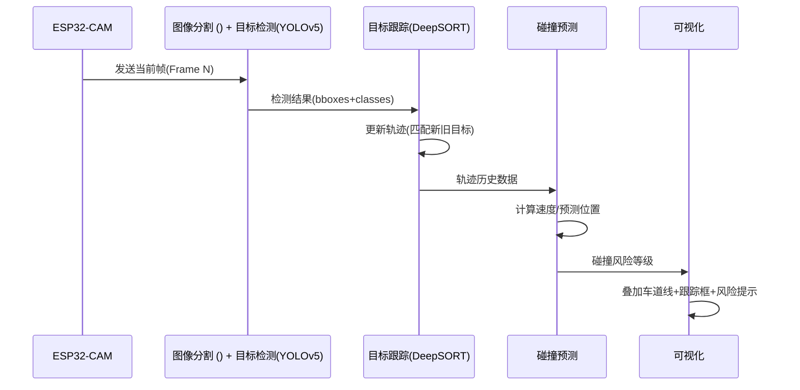

# 基于深度学习的车辆道路障碍检测及碰撞预测方法研究

## Background

​		随着汽车工业的快速发展和城市交通密度的增加，交通事故成为全球关注的重大问题，对人类生命财产安全构成了严峻威胁。传统的车辆安全辅助系统多依赖高成本的硬件或复杂的计算平台，难以在广泛场景中普及。而随着深度学习和嵌入式设备技术的进步，通过低成本、高效能的嵌入式系统实现车辆的实时感知和智能决策成为可能。

​		本研究旨在利用深度学习技术，基于嵌入式ESP-CAM设备实现车道障碍物的实时检测与车辆碰撞风险的智能预测。通过集成轻量化的YOLOv5目标检测算法，系统能够高效识别车道内的行人、动物和非机动车等障碍物，并结合车辆速度和障碍物位置等信息，预测可能的碰撞风险，为驾驶者提供预警信号，避免潜在事故的发生。本研究在保证实时性和准确性的同时，降低了系统部署成本，具备较高的实用价值和推广潜力，有望为智能辅助驾驶和交通安全管理提供一种高效且经济的解决方案。

## Result

​		一个车道障碍检测及碰撞预防系统，包括系统代码、模型参数、测试报告，并对系统的设计、实现、测试及优化过程进行全面阐述

## Papers

[1] 杨会成, 朱文博, 童英. 基于车内外视觉信息的行人碰撞预警方法[J]. 智能系统学报, 2019, 14(4): 752-760.

[2] 马永杰, 马芸婷, 程时升, 等. 基于改进 YOLOv3 模型与 Deep-SORT 算法的道路车辆检测方法[J]. 交通运输工程学报, 2021, 21(2): 222-231.

[3] Zhang Y, Guo Z, Wu J, et al. Real-time vehicle detection based on improved yolo v5[J]. Sustainability, 2022, 14(19): 12274.

[4] Jocher G, Chaurasia A, Stoken A, et al. ultralytics/yolov5: v7. 0-yolov5 sota realtime instance segmentation[J]. Zenodo, 2022.

[5] 何永明, 邢婉钰, 魏堃, 等. 超高速公路自动驾驶车辆换道轨迹规划策略[J]. Journal of South China University of Technology (Natural Science Edition), 2024, 52(4).

[6] 龙腾, 王彧弋, 林军, 等. 轨道交通车载智能化应用技术发展展望[J]. 机车电传动, 2024 (1): 11-21.

[7] 房亮, 关志伟, 王涛, 等. 基于深度学习 LSTM 的智能车辆避撞模型及验证[J]. 汽车安全与节能学报, 2022, 13(1): 104.

[8] 杜泉成, 王晓, 李灵犀, 等. 行人轨迹预测方法关键问题研究: 现状及展望[J]. 智能科学与技术学报, 2023, 5(2): 143-162.

[9] Wang L, Liu X, Ma J, et al. Real-time steel surface defect detection with improved multi-scale YOLO-v5[J]. Processes, 2023, 11(5): 1357.

[10] Kurniawan H, Hariyanto S. Designing Home Security With Esp32-Cam and IoT-Based Alarm Notification Using Telegram[J]. bit-Tech, 2023, 6(2): 95-102.

